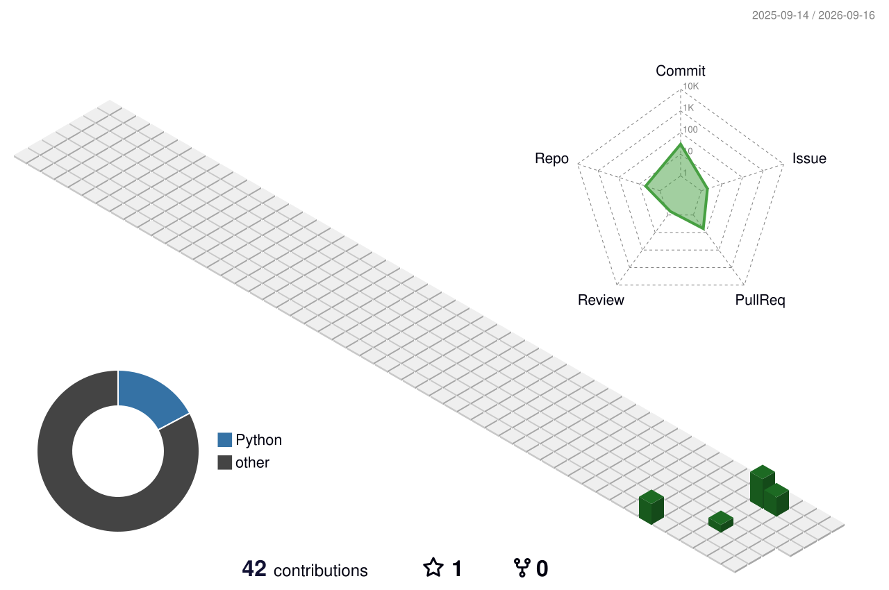

 

  

---

## ⚡ TECHNOLOGY

 

---

## 🚀 BUILDING

 

---

## 📊 GITHUB ANALYTICS

 

---

## 🧊 3D CONTRIBUTION PROFILE

 

---

## 🧠 CORE STACK

 

<table>
<tr>

<td align="center" width="33%">

### MOBILE

Android  
Kotlin  
Firebase

</td>

<td align="center" width="33%">

### WEB

React  
TypeScript  
Node.js

</td>

<td align="center" width="33%">

### AI

Python  
AI Systems  
Automation

</td>

</tr>
</table>

---

## 🌐 CONNECT

 

 

